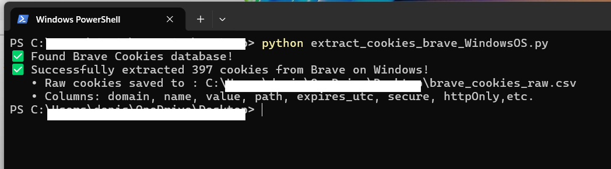
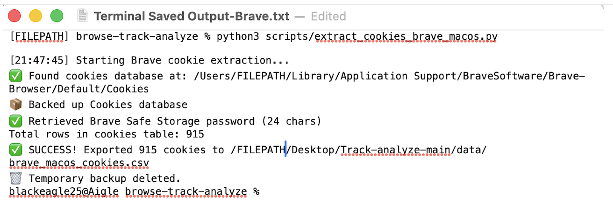
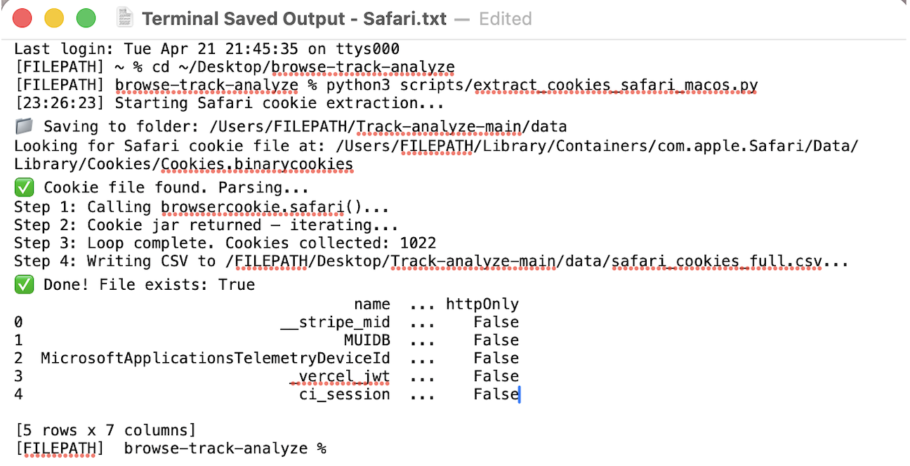

# BROWSER TRACKER ANALYZER - CONCEPT 

__A privacy focused tool for understanding how websites track users across browsers and operating systems.__ 

A practical Python project that extracts and analyzes browser cookies and tracking data across different operating system and platforms in latent form from the cache. The collected data are then collated and parsed by EDA(Exploratory Data Analytics). Machine Learning will be applied later, to identify behavioural patterns, clustering, and potentially invasive tracking.

### Goal
To understand, and visualize how browsers handle user tracking, raising awareness about digital privacy in real-world environments. 

### Key Highlights
- **Cross-platform consistency**: Extracts cookies from Safari(MacOS), Brave(MacOS & Windows), Microsoft Edge(Windows), and iOS browser simulation via Playwright. 
- **Privacy & Compliance Focus**:  Captures detailed cookie metadata(domain, name, value, path, secure, httpOnly, expiry, etc) - highly relevant to data protection, tracking transparency, and regulatory compliance. 
- **Clean Architecture**: Modular scripts, raw data output, and planned interactive dashboard.
- **Real-world skills**: Automation, data-scraping, cross-OS comparison, EDA, and privacy-conscious development. 

### Tech Stack 
- **Language**:  Python 3
- **Core Libraries**:  Pandas, Pathlib, Playwright, SQLite3
- **Visualisation (Upcoming)**: Streamlit + Matplotlib / Seaborn
- **Future ENhancements**:  Machine Learning for tracker pattern analysis and risk scoring 

### TOOLS ###
1. [](https://www.python.org/)
2. [](https://playwright.dev/)
3. [](https://opensource.org/licenses/MIT)

---
### FEATURES
- Cross-platform cookie extraction (Brave, Safari, MS Edge, etc)
- Raw data export to CSV
- Breakdown of cookie and domain details, including security
- **Planned**: Streamlit dashboards for amalgamation of results for  comparison
- **Planned**: ML pipelines for tracker clustering and invasiveness prediction
---

### Current Status (April 2026) ###

__Completed__
1. Brave on MacOS
2. Brave on Windows OS
3. Brave on mobile browser simulation by Playwright
4. Safari on MacOs
5. Microsoft Edge on Windows
   
__Upcoming Additional Pipelines__
1.  Amalgamation of all 5 CSV databases (above) 
3.  Streamlit dashboards for master-data organisation and analytics (of extracted databases from the relevant scripts)
4.  Possibility of the inclusion of Streamlit within Jupyter, rather than as a separate tool.


__________________________________________________________________________________________________________________________________________________

### PROJECT STRUCTURE & CONFIGURATION ###

```
- 'src/'       - Core analysis logic
- 'notebook/' - Jupyter notebooks for EDA reports and experiments
- 'scripts/'   - Standalone utilities for data extraction,fingerprinting, reporting
- 'data/'      - Sample outputs

browser-tracker-analyzer/
├── src/
│   ├── analyzer.py           # Core Python scripts
├── notebook/                 # Jupyter notebook of detailed analysis
│   ├── eda.ipynb
├── scripts                   # standalone utility scripts
│   ├── fingerprint.py        # Fingerprint detection functions
    └── report.py             # Report generation (JSON/CSV/HTML)
    └── extract_cookies_brave_macos.py
    └── extract_cookies_brave_windowsOS.py       
    └── extract_cookies_ios_emulation.py
    └── extract_cookies_safari_macos.py
    └── extract_cookies_IE_windowsOS.py
    └── test.py                # confirms all relevant project libraries & dependencies
    └── compare_cookies.py     # (optional) future merge script 
├── data/
│   ├── brave_macos_cookies.csv   #CSV report derived from 'scripts/extract_cookies_macos.py'
│   └── brave_ios_cookies.csv     #CSV report derived from'scripts/extract_ios_emulation.py'
├── requirements.txt
├── README.md
```

### REQUIREMENTS AND DEPENDENCIES ###
See requirements.txt for full list.
**Key dependencies: Playwright, pandas, csv** <br><br>
NOTE:  Adherence to the minimal versions listed for each dependency in 'requirement.txt' is highly recommended
for the desired results or outcome.


## Installation:
```
bash 
pip install -r  requirements.txt
playwright install  --with-deps
```

### QUICK START ###
```
bash
## Run MacOS Brave cookie extraction
FILEPATH/python3  scripts/extract_cookies_brave_macos.py

## Run MacOS Safari cookie extraction
FILEPATH/python3  scripts/extract_cookies_safari_macos.py 

## Run iOS emulation cookie extraction
FILEPATH/python3  scripts/extracts/ios/emulation.py

## Run Windows OS Brave cookie extraction
FILEPATH\python scripts\extract_cookies_brave_windowsOS.py

## Run Windows OS Microsoft Edge coookie extraction
FILEPATH\python scripts\extract_cookies_IS_windowsOS.py

## Create EDA notebook for deeper visual presentation of cookie behaviour analytics (optional)
bash pip3 install jupyter  (if not in system)
Jupyter Notebook
```

### Core Tools (src)
```
## Analysis Tools

Two versions available in `src/`:

- **analyzer.py**  
  Fast CLI tool to process CSVs and generate JSON/CSV/HTML reports.  
  ```bash
  python src/analyzer.py --mode csv --output analysis --format json
  OR
  cd ~/...filepath/PYTHONPATH=. python3 src/analyzer_eda.py --mode csv --output eda_test --format json

- **analyzer_eda.py**
  An extension of 'analyzer.py'. Interactive, scripted EDA version with summaries, stats, and plots.
  Run directly as shown above (bash).
```

## Sample Outputs

**Brave on Windows - Powershell**


**Brave on MacOS - Terminal**


**Safari on MacOS - Terminal**


### FUTURE ROADMAP (LONG-TERM) ###
```
*  Addition of other browsers for scraping (Chrome, Firefox, Opera, etc)
*  Inclusion of Android OS
*  Inter OS comparision, e.g quantity & prevalence of cookies in Brave or Firefox running in Windows vs MacOS)
*  Advanced EDA visualizations (matplotlib/seaborn)
*  Machine learning pipelines (clustering + invasiveness prediction)
*  Web dashboard using Streamlit
```

### LICENSE ###
```
MIT License
```

### Contact ###

Built by JLL<br>
Feedback and Suggestions welcome!
