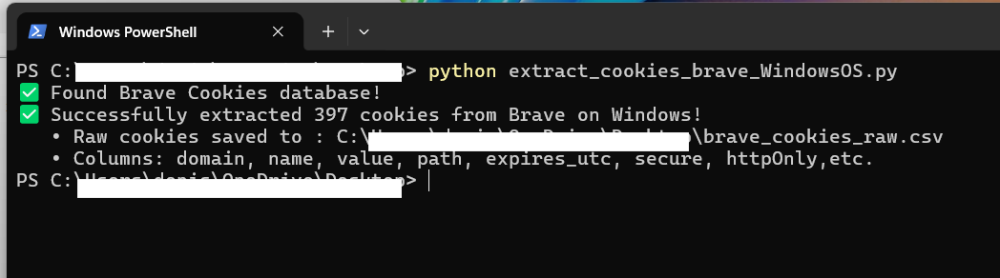
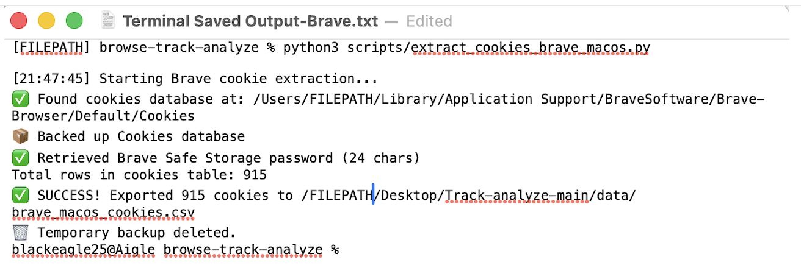
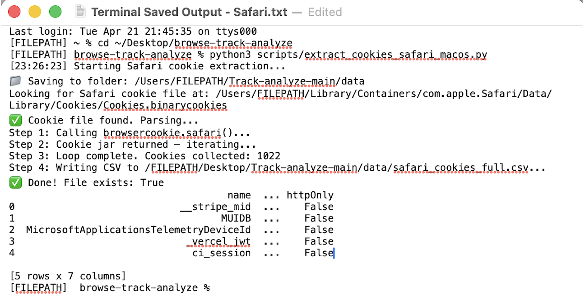
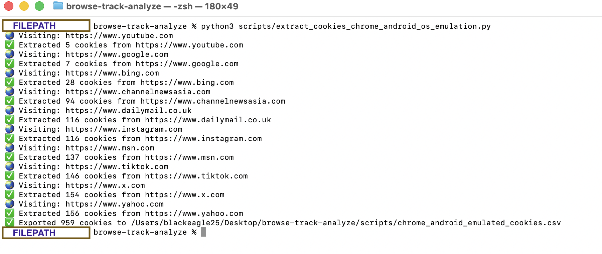

# BROWSER TRACKER ANALYZER - CONCEPT 

__Privacy focused cross-platform cookie-scraping and analytics tool across browsers and operating systems.__ 

### Goal
Utilising Data Analytics, Python-based scraping tools, Streamlit and a Jupyter interactive notebook to highlight the prevalence of cookies, and extent of intrusive behaviour, if any, across different browsers and operating systems, to raise awareness about digital privacy in real-world environments. 

### Key Highlights
- **Cross-platform consistency**: Extracts cookies from Safari(MacOS), Brave(MacOS & Windows), Microsoft Edge(Windows), Chrome(AndroidOS) and Safari(iOS) browser simulation via Playwright. 
- **Privacy & Compliance Focus**:  Captures detailed cookie metadata(domain, name, value, path, secure, httpOnly, expiry, etc), traits highly relevant to data protection, tracking transparency, and regulatory compliance. 
- **Clean Architecture**: Modular scripts, raw data output, and planned interactive dashboard.
- **Real-world skills**: Automation, data-scraping, cross-OS comparison, EDA, and privacy-conscious development.
- **Dashboard**:  includes inter-OS comparison, e.g quantity & prevalence of cookies in Brave vs Safari vs Explorer at al, running in Windows vs MacOS)
*  **Advanced EDA visualization**: Using Matplotlib and Seaborn
*  **Machine learning pipelines**: Includes clustering + invasiveness detection and prediction across platforms

### Tech Stack 
- **Language**:  Python3
- **Core Libraries**:  Pandas, Pathlib, Playwright, SQLite3, Polars
- **Visualisation**: Streamlit,  Matplotlib, Seaborn, XGBoost
- **Future Enhancements**:  Machine Learning for tracker pattern analysis and risk scoring

### Upcoming Improvisations (October 2026)
- **Consolidation of scraping tools**:  Plans to combine the scraping tools for different browsers running on the same platform/OS into Master-Scripts.
- **DONE ✅:
  1) MacOS** Folder containing the Master Py-script for various browsers (Safari/Brave/Chrome/Firefox/Opera)running their respective scrapers in a single ```extract_cookies_macos.py``` master-file for better directory-integration and performance.
  2) Windows** Folder containing the Master Py-script for various browsers (Safari/Brave/Chrome/Firefox/Opera)running their respective scrapers in a single ```extract_cookies_windows_os.py``` master-file for better directory-integration and performance
- **IN PROGRESS ✍🏽** : Creation of additional  **iOS** and **Android** folders respectively,  for even more streamlined consolidation of disparate scraping tools of miscellaneous mobile browsers onto a single Master-list, for both mobile OS platforms.


### BADGES ###
1. [](https://www.python.org/)
2. [](https://playwright.dev/)
3. [](https://opensource.org/licenses/MIT)
4. 
5. 
6. 

---
### FEATURES
- Cross-platform cookie extraction (Brave, Chrome, Safari, MS Edge, iOS, Android) across: MacOS, WindowsOS, AndroidOS, iOS
- Raw data export to CSV
- Breakdown of cookie and domain details, including security
- Streamlit dashboards for amalgamation of results for  comparison
- **Planning**: ML pipelines for tracker clustering and invasiveness prediction

⚠️ __Security & Privacy Disclaimer: Metadata Harvesting
This repository and its associated tools interacts actively with web-browsers, which may contain sensitive metadata content.
Please be advised that automated scraping utilities often extract a lot more than just visible information; background metadata like active session cookies, authentication tokens, IP headers and local storage values can be revealed.  Running unauthorised scraping tools, or granting them deep DOM/Inspection privileges poses high security and privacy risks, including account hijacking, private data exposure, and unauthorised tracking.
Any use of third-party utilities, or metadata analysis pipelines within this project comes entirely at user's own risk. 
The maintainers of this repository disclaim all liability for data breaches or security compromises resulting from external scraping activities.
Use code with caution.__

__________________________________________________________________________________________________________________________________________________

### PROJECT STRUCTURE & CONFIGURATION ###

```
- 'src/'       - Core analysis logic
- 'notebook/'  - Jupyter notebooks for EDA reports and experiments
- 'scripts/'   - Standalone utilities for data extraction,fingerprinting, reporting, OS subfolders
- 'data/'      - Sample outputs

browse-track-analyze/
├── src/
│   ├── analyzer.py           # Core Python scripts
├── notebook/                 # Jupyter notebook of detailed analysis
│   ├── eda.ipynb
├── scripts/                   # standalone utility scripts
│   ├── fingerprint.py         # Fingerprint detection functions
    └── test.py                # confirms all relevant project libraries & dependencies
    └── compare_cookies.py     # (optional) future merge script
    └── report.py             # Report generation (JSON/CSV/HTML)
    └── extract_cookies_brave_ios_emulation.py
    └── extract_cookies_safari_ios_emulation.py
    └── extract_cookies_brave_android_os_emulation.py               
    └── extract_cookies_chrome_android_os_emulation.py
    └── MacOS/
    │   ├── extract_cookies_macos.py             # Py Master-script for ALL browsers running on the MacOS ecosystem
    └── WindowsOS/    
    │   ├── extract_cookies_windows_os.py       #  Py Master-script for ALL browsers running on the Windows ecosystem     
├── data/
│   ├── macos_cookies_full.csv    #CSV report from 'scripts/extract_cookies_macos.py' (actual results vary/ more than 1 file may be saved)
│   └── windows_cookies_full.csv  #CSV report from 'scripts/extract_cookies_windows_os.py' (actual results vary/ more than 1 file may be saved)
│   └── brave_ios_emulated_cookies.csv          #CSV report from 'scripts/extract_cookies_brave_ios_emulate.py'        
│   └── safari_ios_emulated_cookies.csv         #CSV report from 'scripts/extract_cookies_safari_ios_emulate.py'
│   └── brave_android_emulated_cookies.csv      #CSV report from 'scripts/extract_cookies_brave_android_os_emulation.py'
│   └── chrome_android_emulated_cookies.csv     #CSV report from 'scripts/extract_cookies_chrome_android_os_emulation.py'
├── app.py                    # Streamlit library - combines all CSV files in 'data/' into dashboard for high-level presentation 
├── requirements.txt
├── README.md
```

### REQUIREMENTS AND DEPENDENCIES ###
See requirements.txt for full list.
**Key dependencies: CSV(SQLite), Pandas, Playwright, Streamlit** <br><br>
NOTE:  Adherence to the minimal versions listed for each dependency in 'requirements.txt' is highly recommended
for the desired results or outcome.

### DIRECTIONS: 
1. Install the required libraries and dependencies specified in requirements.txt (above) on your local machine. 
2. Surf the web on the different browsers specified (Brave(MacOS)/Brave(Windows)/MsEdge/Safari/iOS), within a **1-day timeframe** for each and **every** browser, on standard settings.
3. Download/branch ```browse-track-analyze``` onto your local machine/directory, and run the relevant scripts in Bash to extract cookies from the different browsers. The extracted .csv databases will be stored in the ```FILEPATH/browse-track-analyze/data``` folder of your local directory.


## Installation:
```
bash 
pip install -r  requirements.txt
playwright install  --with-deps
```

### QUICK START ###
```
bash
## Run MacOS Browser(s) cookie extractions
python3  scripts/MacOS/extract_cookies_macos.py 

## Run iOS emulation cookie extraction
python3  scripts/extracts/ios/emulation.py

## Run Windows Browser(s) cookie extractions
python scripts\WindowsOS\extract_cookies_windows_os.py

## Run AndroidOS emulation cookie extraction
python scripts\extracts\android\emulation.py

## Create EDA notebook for deeper visual presentation of cookie behaviour analytics (optional)
bash pip3 install jupyter  (if not in system)
Jupyter Notebook
```

### Core Tools (src)
```
## Analysis Tools

Two versions available in `src/`:

- **analyzer.py**  
  Fast CLI tool to process CSVs and generate JSON/CSV/HTML reports.  
  ```bash
  python src/analyzer.py --mode csv --output analysis --format json
  OR
  cd ~/...filepath/PYTHONPATH=. python3 src/analyzer_eda.py --mode csv --output eda_test --format json

- **analyzer_eda.py**
  An extension of 'analyzer.py'. Interactive, scripted EDA version with summaries, stats, and plots.
  Run directly as shown above (bash).
```

## Sample Outputs

**Brave on Windows - Powershell**


**Brave on MacOS - Terminal**


**Safari on MacOS - Terminal**


**AndroidOS Playwright Simulation  - Terminal**


### UPDATES - VER.2.0.0 JUL 2026 ###

*  Added Polars to Streamlit dashboard for better consolidation, concise summary, and analysis of amalgamated data from translated datasets (csv)
*  Added XGBoost to Streamlit for a snapshot of machine-learning data analytics to filter and gauge the quantity of three main cookie features- Intrusive, HttpOnly, and Domain Length.
*  Included additional deployment app tools using other platforms apart from Streamlit , eg. Snowflake, Others, etc , for smoother and/or customised application environments.

### UPDATES - VER.2.0.1 AUG 2026 ###
  
*  Inclusion of Android OS, by additional Playwright-simulation scripting .py tools to `/scripts` folder, for Brave and Chrome browsers on Android.
*  Added three additional third-party browsers (Chrome, Firefox, Opera) to MacOS for scraping
*  Organised separate scraping tools for all browsers running on MacOS by consolidation into one Master-list - 'extract_cookies_macos.py' file


### FUTURE ROADMAP (LONG-TERM) ###
```
*  Refinement of XGBoost and Scikit-learn for deeper Machine-Learning capabilities further down the pipeline, ideally when CSV data accumulates with substantial volume and bulk
```

### LICENSE ###
```
MIT License
```

### Contact ###

Built by JLL<br>
**All images and screenshots in this repository are copyrighted.**<br>
Please **do not** download, copy, or use them without written permission.

